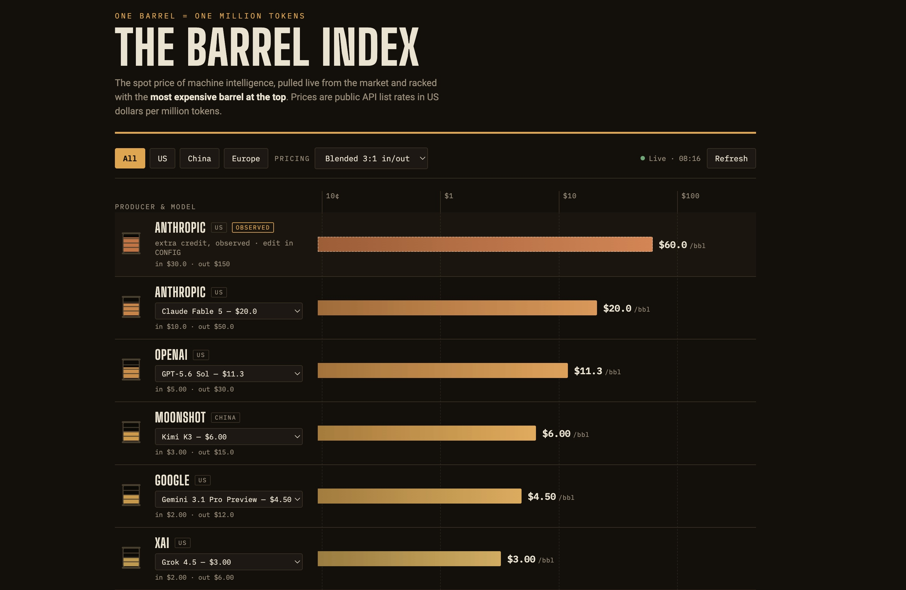

# The Barrel Index

**The spot price of machine intelligence. One barrel = one million tokens.**

A single, self-contained HTML file that shows you, live, what every major AI producer is currently charging per million tokens, racked like a commodity board with the most expensive barrel at the top. No build step, no dependencies, no API key, no server-side anything. Download the file, open it in a browser, or drop it on any static web server, including one running entirely inside your own network.

## Why this exists

The world has quietly become a commodity market for intelligence, and most of us are buying barrels of it without a price board. If you run AI agents that you fund out of your own pocket, you are exposed to that market directly, and the spread is enormous: at the time of writing, the most expensive barrel on the board costs more than a hundred times the cheapest one. But prices move constantly, new producers appear monthly, and it is remarkably easy to be confidently wrong about who is charging what, because the numbers live scattered across pricing pages that all format things differently. This tool exists so that one glance replaces all of that. It was built by a home user who was funding always-on agents out of household money, realised he no longer trusted his own assumptions about who was most expensive, and wanted an impartial instrument on the wall instead.

## What it shows

Each producer appears as an oil drum sitting on a logarithmic price ruler, filled and coloured according to how expensive its barrel currently is, from green at the cheap end through amber to red at the top. The board sorts itself with the most expensive barrel first and rows slide to their new positions when prices reorder. Every producer defaults to its current flagship model, and a dropdown on each row lets you price any other model that producer sells. Region chips filter the board to US, Chinese, or European producers.

Because a barrel really has two prices (input tokens and output tokens are billed at different rates), the headline figure is a blended barrel, weighted three to one toward input to reflect typical agent traffic. A control switches this to a one-to-one blend, input only, or output only, and the raw input and output rates are shown beneath each producer.

## Where the numbers come from

Live figures are pulled from [OpenRouter's open model catalogue](https://openrouter.ai/api/v1/models), a public, keyless feed of published pay-as-you-go API list prices across the industry, in US dollars per million tokens. The page fetches on load, auto-refreshes every thirty minutes, and has a manual refresh button. If the feed is unreachable, it falls back to a snapshot baked into the file and displays a clear warning banner with the snapshot date, so it never fails silently and never silently shows you stale data as if it were live.

One honest limitation: the feed carries published API list prices only. Nobody publishes subscription effective rates or premium metered rates (such as Anthropic's "extra credit") as per-token figures. For those, the board supports *observed* entries: rows you define yourself, either as a multiplier of a producer's live list price or as fixed figures, drawn with a dashed bar and tagged "Observed" so they can never be mistaken for published rates. The file ships with one example: an Anthropic extra-credit row at three times the live list price, which you can tune or delete.

## Configuration

Everything is controlled by a plainly commented `CONFIG` block at the top of the file's script: which producers appear, which model is each producer's permanent flagship, the observed entries and their multipliers, the default blend, and the refresh interval. Dropdown and filter changes last for the browser session; edits to `CONFIG` are permanent. There is deliberately no build system and no local storage: the file itself is the entire application and the entire configuration, which makes it trivial to version, copy between machines, and audit.

## Honest caveats

Barrels are not equal. A dollar barrel and a hundred-dollar barrel do not contain the same intelligence, and this board makes no claim about quality, capability, or value for money. It answers exactly one question, impartially: what does a million tokens cost, from whom, right now. Prices shown are list rates and may differ from negotiated, cached, batch, or regional pricing. This project is not affiliated with OpenRouter or with any model producer.

## Licence

MIT. Use it, fork it, put it on the wall of your own operations room.
